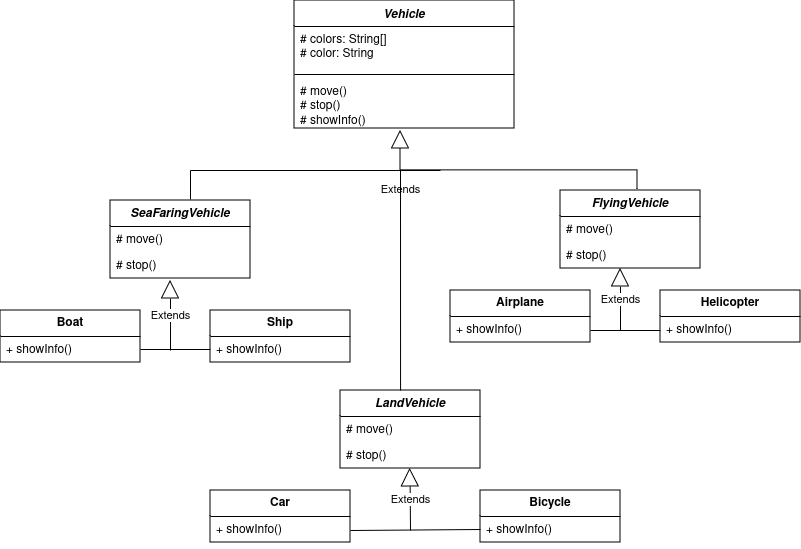

Основываясь на логике объектов реального мира, абстрактный класс Vehicle может иметь наследниками только абстрактные классы LandVehicle, SeaFaringVehicle и FlyingVehicle. Каждый из этих трёх классов может быть родителем для неограниченного количества классов транспортных средств. Здесь приведено по два варианта классов наземного, водного и воздушного транспорта. В качестве информации об объекте для каждого из этих 6 классов выбрано случайное значение поля "цвет". 

